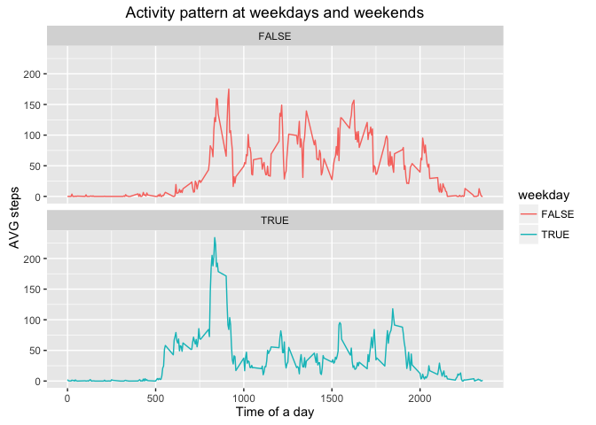

# Reproducible Research: Peer Assessment 1


## Loading and preprocessing the data

```r
unzip(zipfile="activity.zip",exdir="./data")
rawData <- read.csv("data/activity.csv",stringsAsFactors=FALSE)
rawData$date <- as.Date(rawData$date, "%Y-%m-%d")

stepsByDay <- summarize(group_by(rawData, date), sSteps = sum(steps, na.rm = TRUE))

stepsByInterval <- summarize(group_by(rawData, interval), sSteps = sum(steps, na.rm = TRUE), avg = mean(steps, na.rm = TRUE))
```


## What is mean total number of steps taken per day?


```r
qplot(stepsByDay$sSteps, geom="histogram") 
```

<!-- -->

```r
stepsMedian = median(stepsByDay$sSteps, na.rm = TRUE)
stepsMean = mean(stepsByDay$sSteps, na.rm = TRUE)
```

The mean of the total number of steps per day is 9354.2295082and the median is 10395

## What is the average daily activity pattern?


```r
ggplot(stepsByInterval, aes(interval, avg)) + geom_line() + xlab("Time of a day") + ylab("AVG steps")
```

<!-- -->

```r
stepsMax <- stepsByInterval[which(stepsByInterval$avg == max(stepsByInterval$avg)), ]$interval
```

The interval with the maximum steps is 835.

## Imputing missing values


```r
countNa <- sum(is.na(rawData$steps))

#rowWithNas <- is.na(rawData$steps)

completedData <- rawData

for(i in 1:nrow(rawData)) {
  row <- rawData[i,]
  if(is.na(row$steps)) {
#    print("found")
    completedData[i,]$steps <- stepsByInterval[which(stepsByInterval$interval == row$interval),]$avg
  }
}

qplot(stepsByDay$sSteps, geom="histogram") 
```

<!-- -->

```r
cStepsMedian = median(stepsByDay$sSteps, na.rm = TRUE)
cStepsMean = mean(stepsByDay$sSteps, na.rm = TRUE)
```

With the cleaned data, the mean of the total number of steps per day is 9354.2295082and the median is 10395


```r
tableData <- matrix(c(stepsMean, cStepsMean, stepsMean - cStepsMean, stepsMedian, cStepsMedian, stepsMedian - cStepsMedian),ncol=3,byrow=TRUE)
colnames(tableData) <- c("Incomplete Dataset","Filled Datase","Difference")
rownames(tableData) <- c("Mean","Median")

tableData <- as.table(tableData)

kable(tableData, digits=2)
```

          Incomplete Dataset   Filled Datase   Difference
-------  -------------------  --------------  -----------
Mean                 9354.23         9354.23            0
Median              10395.00        10395.00            0


## Are there differences in activity patterns between weekdays and weekends?


```r
rawData$weekday <- !grepl("S(am|on)", weekdays(rawData$date))

stepsByWeekday <- summarize(group_by(rawData, weekday,interval), avg = mean(steps, na.rm = TRUE), sSteps = sum(steps, na.rm = TRUE))

ggplot(stepsByWeekday) + geom_line(aes(interval,avg, group=weekday, color=weekday)) + xlab("Time of a day") + ylab("AVG steps") + ggtitle("Activity pattern at weekdays and weekends") + facet_wrap(~weekday,ncol = 1)
```

<!-- -->

